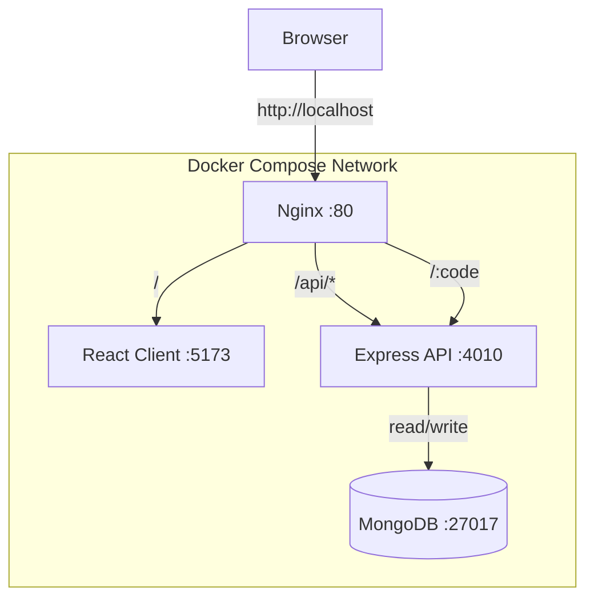
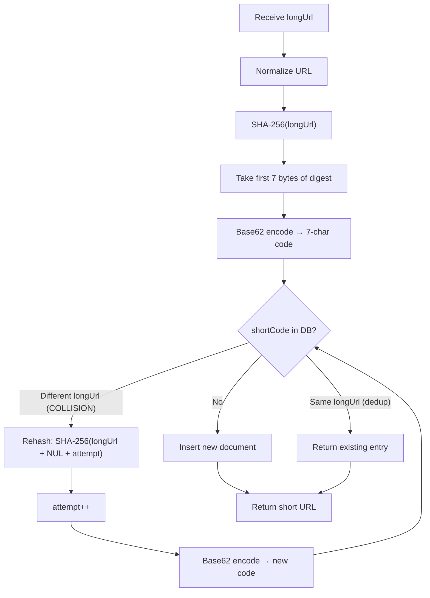
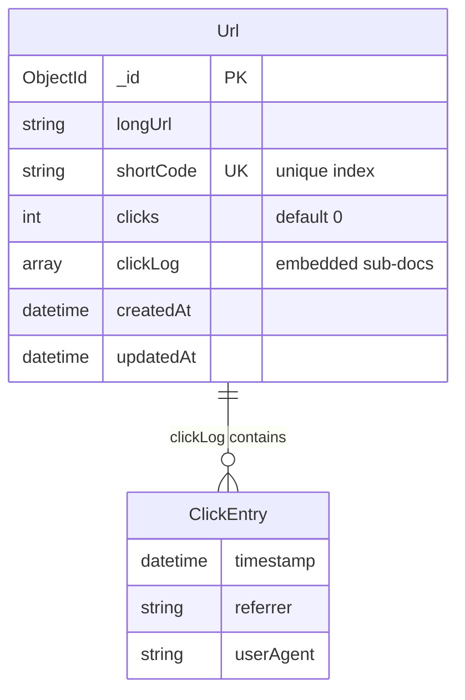
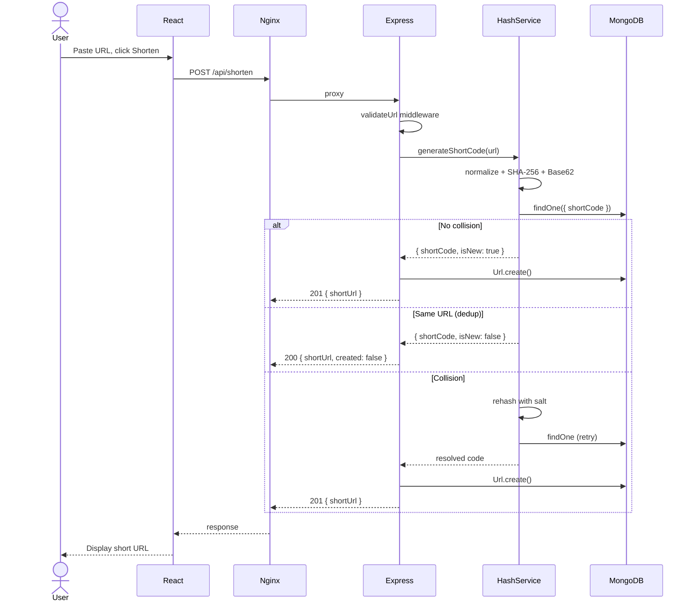
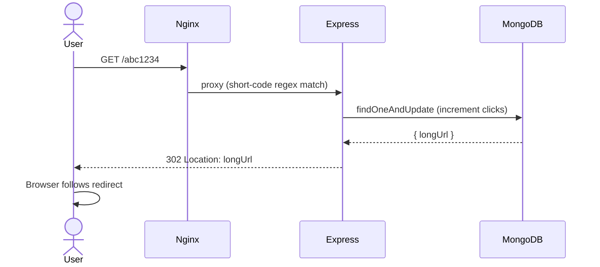
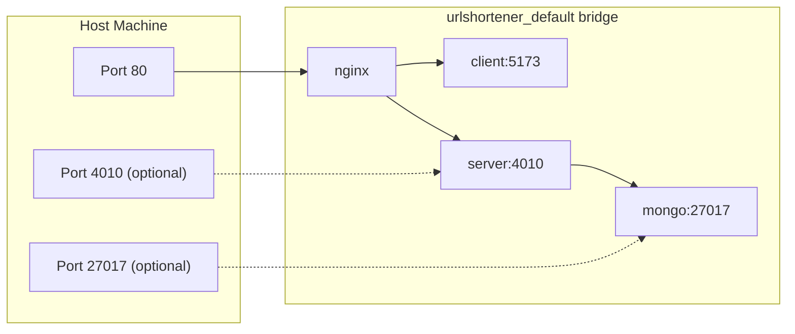

# URL Shortener — Technical Documentation

## 1. System Architecture



| Service    | Technology          | Port                                | Role                                                                                   |
| ---------- | ------------------- | ----------------------------------- | -------------------------------------------------------------------------------------- |
| **nginx**  | Nginx 1.27 Alpine   | 80 (host)                           | Reverse proxy, routes `/api` and short-code paths to Express, everything else to React |
| **client** | React 18 + Vite 6   | 5173 (internal)                     | Single-page UI for shortening, listing, analytics                                      |
| **server** | Node 20 + Express 4 | 4010 (internal, optionally mapped)  | REST API, redirect handler, hashing engine                                             |
| **mongo**  | MongoDB 7           | 27017 (internal, optionally mapped) | Persistent storage with unique indexes                                                 |

## 2. URL Shortening — Hashing Algorithm

### 2.1 Algorithm Overview



### 2.2 Step-by-Step

1. **Normalize** the incoming URL: lowercase scheme + host, strip trailing slashes on root paths.
2. **SHA-256** the normalized string → 32-byte digest.
3. **Extract first 7 bytes** (56 bits) and interpret as a big-endian unsigned integer.
4. **Base62-encode** the integer into a 7-character alphanumeric code (`0-9 A-Z a-z`).
5. **Look up** the code in MongoDB:
   - **No match** → insert a new `Url` document → return the short URL.
   - **Match, same `longUrl`** → deduplication, return existing short URL.
   - **Match, different `longUrl`** → **collision** → proceed to retry.
6. **Collision retry**: append `\0{attempt}` (NUL byte + attempt number) to the original URL, rehash from step 2. Retry up to `MAX_COLLISION_RETRIES` (default 10).
7. If retries exhausted → return 500 error.

### 2.3 Base62 Encoding

Character set: `0123456789ABCDEFGHIJKLMNOPQRSTUVWXYZabcdefghijklmnopqrstuvwxyz`

With 7 characters: 62^7 = **3,521,614,606,208** unique codes (~3.5 trillion).

### 2.4 Collision Probability (Birthday Paradox)

The probability of at least one collision among `n` URLs in a keyspace of size `N = 62^7`:

```
P(collision) ≈ 1 − e^(−n² / 2N)
```

| URLs stored (n) | P(collision)  |
| --------------- | ------------- |
| 10,000          | ~0.000000001% |
| 100,000         | ~0.00000142%  |
| 1,000,000       | ~0.0142%      |
| 10,000,000      | ~1.41%        |
| 100,000,000     | ~75.6%        |

At **1 million URLs**, the probability of any collision is ~0.014% — and the retry mechanism handles even those rare cases.

### 2.5 Collision Mitigation Strategies

| Strategy                      | Implementation                                    | Status                                                |
| ----------------------------- | ------------------------------------------------- | ----------------------------------------------------- |
| **Check-and-retry with salt** | Append `\0{N}` and rehash up to 10 times          | Implemented                                           |
| **Unique index on shortCode** | MongoDB unique constraint catches race conditions | Implemented                                           |
| **URL normalization**         | Same URL always hashes to same code (dedup)       | Implemented                                           |
| **Configurable code length**  | `SHORT_CODE_LENGTH` env var (7-10)                | Implemented                                           |
| **Bloom filter pre-check**    | In-memory probabilistic check before DB query     | Documented (not implemented — overkill at this scale) |
| **Counter-based fallback**    | Auto-increment ID → Base62 if hash retries fail   | Documented (not implemented)                          |

## 3. Database Schema



### Indexes

- `shortCode`: **unique** — primary lookup for redirects and collision checks
- `longUrl`: **non-unique** — used for deduplication lookups

## 4. API Reference

| Method   | Path                    | Body / Query               | Response                                                        |
| -------- | ----------------------- | -------------------------- | --------------------------------------------------------------- |
| `POST`   | `/api/shorten`          | `{ "url": "https://..." }` | `201 { shortUrl, shortCode, longUrl, created }`                 |
| `GET`    | `/api/urls`             | `?page=1&limit=20`         | `200 { urls[], page, totalPages, total }`                       |
| `GET`    | `/api/urls/:code/stats` | —                          | `200 { shortCode, longUrl, clicks, recentClicks[], createdAt }` |
| `DELETE` | `/api/urls/:code`       | —                          | `200 { deleted, shortCode }`                                    |
| `GET`    | `/:code`                | —                          | `302` redirect to `longUrl`                                     |
| `GET`    | `/health`               | —                          | `200 { status: "ok" }`                                          |

### Error Responses

| Code | Meaning                                    |
| ---- | ------------------------------------------ |
| 400  | Invalid URL, missing field, blocked domain |
| 404  | Short code not found                       |
| 409  | Short code conflict (race condition)       |
| 429  | Rate limit exceeded                        |
| 500  | Server error (e.g. hash retries exhausted) |

## 5. Sequence Diagrams

### 5.1 Shorten Flow



### 5.2 Redirect Flow



## 6. Docker Compose Networking



All inter-service communication happens on the Docker bridge network. Only Nginx port 80 is mandatory on the host.

## 7. Rate Limiting

| Limiter | Scope               | Window | Max Requests |
| ------- | ------------------- | ------ | ------------ |
| Global  | All endpoints       | 15 min | 100          |
| Shorten | `POST /api/shorten` | 1 min  | 20           |

Implemented via `express-rate-limit` with standard headers (`RateLimit-*`).

## 8. Security Measures

- **Helmet**: sets secure HTTP headers (CSP, HSTS, X-Frame-Options, etc.)
- **URL validation**: only `http://` and `https://` schemes allowed
- **Domain blocklist**: prevents shortening of other shortener URLs (recursion protection)
- **Rate limiting**: prevents abuse and DDoS-style requests
- **Input sanitization**: URLs are normalized before hashing

## 9. Scalability Considerations

For production scale beyond this capstone:

| Concern                  | Solution                                                           |
| ------------------------ | ------------------------------------------------------------------ |
| **Read-heavy redirects** | Add Redis cache in front of MongoDB for hot short codes            |
| **Write throughput**     | MongoDB sharding on `shortCode`                                    |
| **Horizontal scaling**   | Stateless Express servers behind a load balancer                   |
| **Global latency**       | CDN edge workers for redirect (302) at the edge                    |
| **Analytics volume**     | Move `clickLog` to a separate time-series collection or ClickHouse |
| **Code exhaustion**      | Increase `SHORT_CODE_LENGTH` from 7 to 8 (×62 capacity)            |

## 10. Running the Project

```bash
# Clone and start
cd capstone-url-shortener
cp .env.example .env
docker-compose up --build

# Application is at http://localhost
# API directly at http://localhost:4010 (if port mapped)
```

### Running Tests

```bash
cd server
npm test          # runs Jest (unit + integration — needs local MongoDB for api.test.js)
```

### Environment Variables

| Variable                | Default                              | Description                      |
| ----------------------- | ------------------------------------ | -------------------------------- |
| `MONGODB_URI`           | `mongodb://mongo:27017/urlshortener` | MongoDB connection string        |
| `BASE_URL`              | `http://localhost`                   | Prefix for generated short URLs  |
| `SHORT_CODE_LENGTH`     | `7`                                  | Length of generated short codes  |
| `MAX_COLLISION_RETRIES` | `10`                                 | Max rehash attempts on collision |
| `RATE_LIMIT_WINDOW_MS`  | `900000`                             | Global rate limit window (ms)    |
| `RATE_LIMIT_MAX`        | `100`                                | Max requests per window          |
| `API_PORT`              | `4010`                               | Express server port              |
| `NGINX_PORT`            | `80`                                 | Host-facing Nginx port           |
| `MONGO_PORT`            | `27017`                              | Host-facing MongoDB port         |
